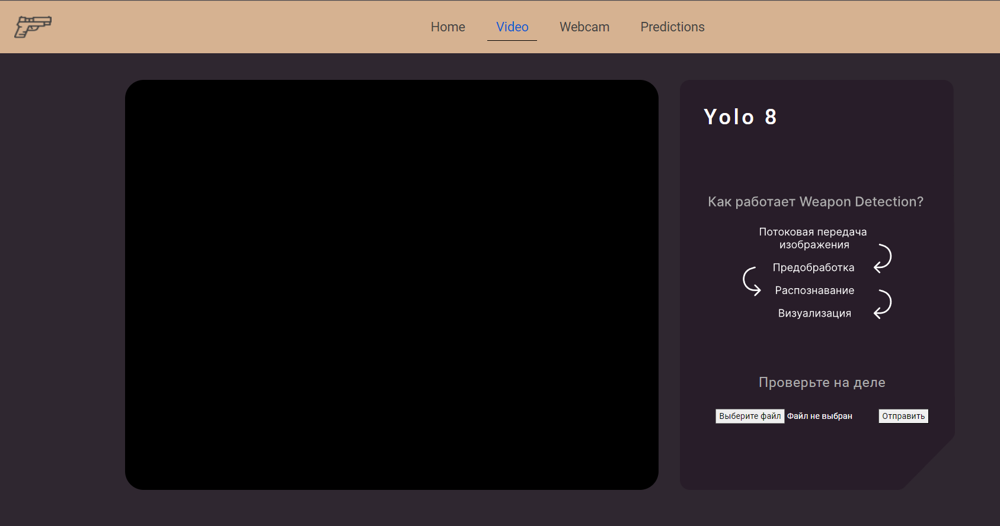
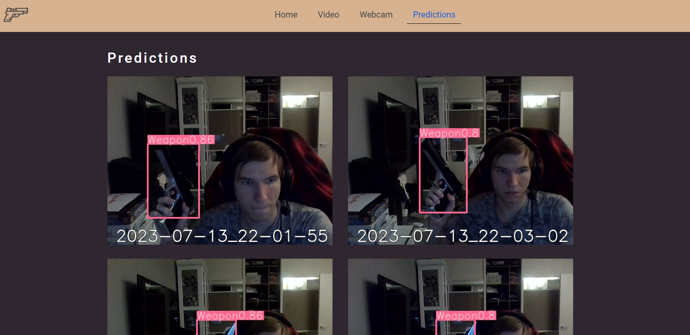

# Weapon Detection YOLO 8 Project For ITMO JUNIOR ML Contest
## Описание
Проект YOLOv8_Weapon_Detection является веб-приложением для обнаружения оружия на видео с использованием модели YOLOv8.
## Установка

1. Скопируйте репозиторий:
   [https://github.com/AzekAriman/ITMOProject.git](https://github.com/AzekAriman/ITMOProject.git)
2. Установите зависимости, указанные в файле `requirements.txt`:
```python
pip install -r requirements.txt
```
3. Запустите веб-приложение:
находящееся в FlaskAPP_YOLOv8_Weapon_Detection/flaskapp.py
4. Откройте браузер и перейдите по адресу [http://localhost:5000](http://localhost:5000), чтобы использовать веб-приложение.

## Использование
1. Чтобы проверить как работает веб приложение переходите на страницу Video или Webcam

2. В случае с видео, выберите файл, содержащий сцены с оружием и загрузите его.
3. Нажмите кнопку "Отправить", чтобы запустить алгоритм обнаружения оружия.
4. Просмотрите видео-поток с результатами обнаружения оружия.
5. Для просмотра наилучших предсказаний перейдите к разделу "Predictions" в заголовке, где вы сможете увидеть фотографии, для которых вероятность наличия оружия превышает пороговое значение 0.7. Каждая фотография сопровождается меткой даты и времени.



